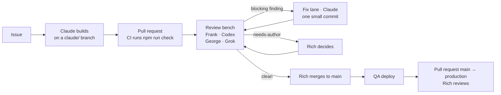

# tC Admin

tC Admin is a web app for Bible translation team leaders and project managers. With it, a manager sets up a Bible or Open Bible Stories project on Door43, adds its books or stories, sees whether the project is healthy, and releases exactly the books they choose. No git, branches, or hand-written metadata are involved. translationCore 4 is where the translating happens; tC Admin handles everything around it, so a translation team can release its work when the team says it is ready, without asking unfoldingWord to do the routine steps.

**Status:** Milestone 1 is in progress. It is due on 21 October 2026, the same day as its demo. A working build runs against QA Door43 at <https://tc-admin-qa.unfoldingword.workers.dev>; to try it you need an account on `qa.door43.org`, and anything you make there is cleared at the next weekly QA reset. tC Admin does not run on production Door43 yet.

## A few words first

| Term | Meaning |
| --- | --- |
| Door43 | unfoldingWord's content service, where translation projects are stored, with their history and releases (`git.door43.org`; its test copy is `qa.door43.org`). tC Admin signs in with your Door43 account and acts as you. |
| Project | A Door43 repository that holds one Bible translation or one Open Bible Stories translation in Scripture Burrito format. Only these are projects. |
| Scripture Burrito | An open standard for packaging Scripture with its metadata (`metadata.json`). tC Admin creates and releases nothing else. |
| Open Bible Stories | Fifty Bible stories, translated as a single project. |
| Coverage | How many books are present out of the project's scope (27, 39, or 66 books; 50 stories). It counts files, not how much has been translated. |
| Health check | Door43's own check of a project. tC Admin shows what Door43 found, as Door43 reports it. |
| Release, pre-release | A published, numbered version of a project on Door43. A pre-release can later be promoted to a full release without changing its contents. |

The full glossary is [CONTEXT.md](CONTEXT.md).

## What it does today (Milestone 1)

- **Sign in with Door43.** Your Door43 account and its permissions are the only ones used. tC Admin never sees your password, and your token never reaches the browser.
- **See your projects.** Every Bible and Open Bible Stories project you can write to, grouped by owner with your organizations first, each with its coverage and health. "Show all projects" also lists the repositories tC Admin cannot manage, with the reason.
- **Create a project.** Give a title, an abbreviation, and a language (and, for a Bible, the testament scope). You get a new repository with valid Scripture Burrito metadata on the default branch `main`, named `<language>_<abbreviation>`.
- **Add books or stories,** two ways:
  - *Upload* USFM or Markdown files. Each file is identified as a book or story from its contents and name, and you confirm it. An overwrite shows you what changes before anything is written.
  - *Import* from any repository in the Door43 catalog, in any format: its latest content or its last release, all of its books or only some. The source is never written to.
- **Read the health check.** Door43's findings for the project's default branch and for its latest full release, grouped by check.
- **Release exactly what is ready.** Mark each book to include, carry forward, or leave out. tC Admin then:
  1. assembles a release snapshot from the previous release plus your choices, on a temporary branch, without touching the default branch;
  2. waits for Door43's health check on it;
  3. proposes a version number and release notes, which you review.

  You then create a full release or a pre-release, and can promote a pre-release later. A release preparation in progress is still there after a reload or a new sign-in, ready to continue or discard.
- **Plan before apply.** Before anything is written to Door43, you see a plan listing exactly what will be written. Applying it writes only those things and gives you a receipt.

The Milestone 1 demo releases a real Bahtraku Bible on production Door43 ([demo script](docs/demo-script.md)).

## What is coming

Milestones 2 and 3 have target months, not dates, and will be re-planned after the Milestone 1 demo ([roadmap](docs/roadmap.md)).

**Milestone 2: Manage** (target November 2026)
- Metadata editing ([#46](https://github.com/unfoldingWord/tc-admin-app/issues/46)): a form over the project's Scripture Burrito metadata, checked when you leave a field and when you save, and shown as a diff before it is committed.
- Recovery when project setup did not finish ([#49](https://github.com/unfoldingWord/tc-admin-app/issues/49)): if creating a project stopped partway, resume from the step that failed without deleting the repository.

**Milestone 3: Pilot** (target December 2026), on production Door43 under an unfoldingWord domain, with the Yayasan BahtraKu team
- Accessibility to WCAG 2.2 AA ([#50](https://github.com/unfoldingWord/tc-admin-app/issues/50)).
- Security review of sign-in, sessions, uploads, and diagnostics ([#51](https://github.com/unfoldingWord/tc-admin-app/issues/51)).
- Performance for portfolios of more than 100 repositories ([#52](https://github.com/unfoldingWord/tc-admin-app/issues/52)).
- Operations: custom domain, production secrets, a runbook, and monitoring of Door43's availability ([#53](https://github.com/unfoldingWord/tc-admin-app/issues/53)).
- The pilot itself ([#54](https://github.com/unfoldingWord/tc-admin-app/issues/54)): named testers making one real release a week for four weeks.

**Not planned:** editing translation text (translationCore 4 does that); other resource types such as translationNotes or translationWords; releasing a Resource Container, translationStudio, or translationCore repository as it is (import its books into a new project instead); releases that span several repositories. The full list is under "Deferred" in the [roadmap](docs/roadmap.md).

## For developers

### Layout

| Path | What lives there |
| --- | --- |
| `shared/schema/` | The operation catalog as Zod schemas: every operation's input, output, and errors. This is the only source of API types. |
| `worker/` | The Cloudflare Worker. `src/door43/` is the Door43 adapter (Door43's data shapes stay inside it), `src/model/` holds the rules with no I/O, `src/operations/` has one module per operation, and `src/http/` is the HTTP routes (Hono). It also serves the built web app. |
| `web/` | The interface: Vite, React, TypeScript. |
| `fixtures/door43/` | Recorded Door43 answers, so tests run without credentials. |
| `scripts/` | The documentation check, the QA seed script, and the live Door43 probes. |
| `e2e/` | One Playwright sign-in test against QA. |
| `docs/` | The design documents (below). |
| `prototypes/door43-mcp` | An early proof of concept. Not part of tC Admin. |

Start with [AGENTS.md](AGENTS.md). It is the entry point for people and agents alike: the document tower, the five rules, and how to work an issue.

### Get started

You need Node 24 or later. For sign-in you also need the QA OAuth application's client id and secret, which Rich can provide.

```
npm ci                    # once, from the repository root (npm workspaces: shared, worker, web)
cp .env.example .env      # fill in DOOR43_CLIENT_ID and DOOR43_CLIENT_SECRET;
                          # SESSION_SIGNING_KEY: openssl rand -base64 32
npm run check             # docs check, lint, typecheck, and tests: what CI runs
npm run dev               # builds web/ and runs the Worker against QA Door43
```

Open <http://127.0.0.1:8787>, not `localhost`: Door43 accepts sign-in callbacks only at the registered 127.0.0.1 addresses. To reload while you edit the interface, run `npx wrangler dev` and `npm run dev --workspace web` side by side.

Never commit a value from `.env`, and never paste one into a log, a test, or a chat.

### Checks and tests

- `npm run check` runs every check, in CI on every pull request and locally: relative links and identifiers across the documents, oxlint (it also rejects `any` and imports that cross layers the wrong way), TypeScript strict, and Vitest for each workspace. Test titles start with the id of the invariant they prove ([invariants](docs/invariants.md)).
- `npm run e2e` signs in on QA in a real browser as the test user, through the deployed QA Worker unless `E2E_BASE_URL` names another address. It needs `TEST_USER` and `TEST_PASSWORD` in `.env`. Set `E2E_HEADLESS=1` to run it headless. Run `npx playwright install chromium` once per machine. This test is not part of `npm run check`.
- The live write probes in `scripts/probe/` run the Worker's own code against QA with a `TEST_TOKEN` and refuse production. [AGENTS.md](AGENTS.md) lists them, and each run is recorded in the [evidence register](docs/evidence.md).

### Environments

| | QA | Production |
| --- | --- | --- |
| Worker | `tc-admin-qa` | `tc-admin` (not created yet, #9) |
| Address | <https://tc-admin-qa.unfoldingword.workers.dev> | `https://tc-admin.unfoldingword.workers.dev`, later a custom domain (#53) |
| Door43 | `https://qa.door43.org` | `https://git.door43.org` |
| Deploys from | the head of `main` | the protected `production` branch, moved only by a pull request from `main` that Rich reviews |

Both environments are defined in [`wrangler.jsonc`](wrangler.jsonc). Its top level is QA, so a `wrangler deploy` without `--env` can only reach QA. Each Worker has its own KV namespaces (`SESSIONS`, `PLANS`) and its own secrets (`DOOR43_CLIENT_ID`, `DOOR43_CLIENT_SECRET`, `SESSION_SIGNING_KEY`), which are kept in Cloudflare and nowhere else. QA is where development happens. Production is used only for sign-in checks, the demo, and the pilot. The full setup is in [docs/deployment.md](docs/deployment.md).

### Redeploy the QA Worker

The repository is not yet connected to Cloudflare Workers Builds (#9), so merging to `main` does not deploy anything yet. Until it is connected, QA is redeployed by hand from a clean checkout of `main`. Use a separate worktree so your own work stays untouched:

```
git fetch origin
git worktree add ../tc-admin-deploy origin/main
cd ../tc-admin-deploy
npm ci && npm run check && npm run build      # Wrangler serves web/dist, which only the build writes
npx wrangler login                            # once per machine, with access to unfoldingWord's Cloudflare account
npx wrangler deploy --env qa
```

Then confirm it:
- `https://tc-admin-qa.unfoldingword.workers.dev/api/situation` answers `"configured": true`.
- The page loads the new bundle. It can take about half a minute to appear.
- `E2E_HEADLESS=1 npm run e2e`, run from your usual checkout, signs in.

Record the commit and the Worker version in [docs/deployment.md](docs/deployment.md) §3, then `git worktree remove ../tc-admin-deploy`. The secrets stay set, so `wrangler secret put` is not repeated.

Once Workers Builds is connected, every merge to `main` deploys QA, and every pull request gets a preview build. Sign-in does not work on previews, because Door43 accepts only registered callback addresses.

### After a QA Door43 reset

Every Monday `qa.door43.org` becomes a fresh copy of production. The Bahtraku repositories come back with the copy, but everything made on QA in `tc-admin-qa` and `tc-admin-qa-org` is lost, because both are empty on production. Rebuild the standard test projects with the seed script:

```
node --env-file=.env scripts/seed-qa.mjs --plan   # show what it would build
node --env-file=.env scripts/seed-qa.mjs
```

It builds three projects through the Worker's own operations:
- `tc-admin-qa-org/id_seedtb`: a Bible with a full release `v1.0.0`, and a pre-release `v1.1.0` waiting to be promoted.
- `tc-admin-qa-org/en_seedobs`: Open Bible Stories with a full release.
- `tc-admin-qa/id_seedhf`: a Bible that has never been released, so it has health findings.

Running it twice is safe: it leaves alone any project that already exists. It needs a `TEST_TOKEN` issued by QA, since a token works only on the host that issued it (E23), and it refuses any other host. Whether the QA OAuth application survives a reset has not yet been confirmed (#4, Q9). If sign-in on QA fails after a reset, check that first.

## How we build it

tC Admin is built by one engineer working part time with AI agents, with product and design support from Birch. Every change goes through the same loop:



1. **Issue.** Every change starts as a GitHub issue in a milestone. Its Traceability section names the parts of the specification, the invariants, the evidence, and the operations it touches ([traceability](docs/traceability.md)).
2. **Build.** A Claude Code session works the issue on a `claude/<name>` branch, following [AGENTS.md](AGENTS.md): the code goes in the layer the module map names, the tests are named for the invariants they prove, and the documents the change affects are updated. It pushes only when `npm run check` passes.
3. **Pull request.** Opened with the template (what changes, invariants, evidence, verification, documents updated), marked ready, with `uwreview` added as a reviewer.
4. **Review.** The unfoldingWord review bench reviews each new head about five minutes after a push. Frank (Codex) and George (Grok) each review it on their own. A pull request over 800 changed lines needs both of them clean.
5. **Fix.** A blocking finding goes to the bench's fix lane, a separate Claude instance that commits one small repair to the branch, within the pull request's own files. The author pulls before pushing again, and reverts a fix only with a reason given on the pull request. A finding marked `needs-author` is Rich's decision.
6. **Merge and deploy.** A person, Rich, merges once the bench is clean on the head. QA is then redeployed. A production release will be a pull request from `main` to `production`, reviewed by Rich.

"Done" means the acceptance criteria hold on QA, the tests pass, the documents are updated, the evidence is recorded, and the bench is clean. Pushing code is not enough.

## Documentation

Each document answers one question. Read downward for why, upward for how.

- [Vision](docs/vision.md): why this exists
- [Product specification](docs/product-spec.md): what it must do, with acceptance scenarios S1 to S7
- [Domain model](docs/domain-model.md) and [glossary](CONTEXT.md): the concepts, their states, and their identifiers
- [Invariants](docs/invariants.md): what must never break, numbered and tested
- [Operation catalog](docs/operations.md): everything the system can do, each with a plan, an apply, a receipt, and typed errors
- [Architecture](docs/architecture.md): the layers and where code goes
- [Architecture decisions](docs/adr): why it is built this way
- [Evidence register](docs/evidence.md): what has been verified about Door43, and what is still open and who decides it
- [Roadmap](docs/roadmap.md): milestones and epics; [GitHub milestones](https://github.com/unfoldingWord/tc-admin-app/milestones)
- [Traceability](docs/traceability.md): how every issue connects to the documents above
- [Deployment](docs/deployment.md): build, check, and deploy
- [Demo script](docs/demo-script.md): the Milestone 1 demo, step by step

## External references

- [Door43 Content Service](https://git.door43.org/)
- [Scripture Burrito specification](https://docs.burrito.bible/)
- [Resource Container manifest specification](https://resource-container.readthedocs.io/en/latest/manifest.html)
- [translationCore 4 design system](https://github.com/unfoldingWord/translationCore4)
- [Door43 release tooling reference](https://github.com/unfoldingWord-dev/release_uw_resources)

## License

[MIT](LICENSE)
